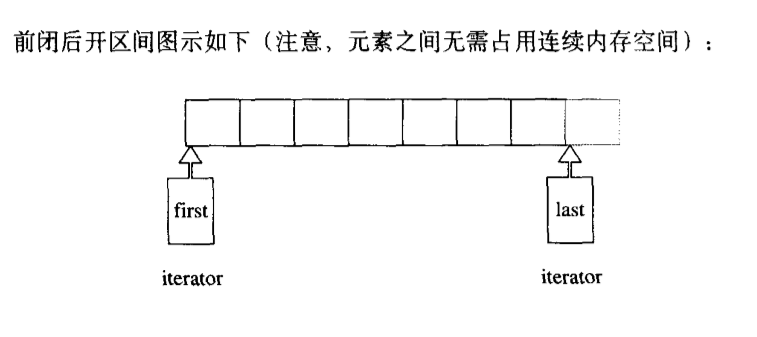

## STL源码解析

### 第一章：STL源码概述与版本介绍
* 前闭后开区间[first, last)，表示从first开始，直到last-1，迭代器最后一个指的是最后一个元素的下一个位置，如下图所示
> 
* STL中的迭代器实际上可以理解为一种泛化的指针类型，重载了operator*(), operator->(),operator++()和operator++(int)
* 仿函数实际上是重载了 
```c++
template<typename T>
class C{
public:
	T operator()(param lists){
		...
	}
};

int main(){
	C<T> cObj;

	//以下使用仿函数，就像使用一般函数一样
	cout << cObj(value lists) << endl;

	//以下使用仿函数，会先产生临时对象（第一对小括号），然后临时对象调用第二对小括号
	cout << cObj()(value lists) << endl;

	return 0;
}
```

### 第二章：空间配置器
* SGI 虽然也定义有一个符合部分标准、名为allocator的配置器，但是SGI却从未使用过，也不建议我么使用，主要是因为其效率不佳，他只是把C++的::operator new 和::operator delete 做了一层薄薄的包装
* STL规定的配置器结构示意图如下
> 

### 第三章：迭代器概念与traits编程技法
* STL的中心思想就是将容器和算法分开，彼此独立设计，最后通过一个迭代器使他们链接在一起（迭代器扮演桥梁的作用）
* 迭代器相应型别有五种
> 1. value type:是指迭代器所指对象的型别
> 2. difference type：是指两个迭代器之间的距离，可以用来表示一个容器的最大容量
> 3. reference type 
> 4. pointer type
> 5. iterator_category：包括input iterator（只读）,output iterator（维写）, forward iterator, bidirectional iterator（双向迭代器）, random access iterator（随机迭代器，支持偏移量大于1）
* [traits编程](https://blog.csdn.net/shudou/article/details/10270971 "traits编程详解")主要是帮助算法识别迭代器的属性（通过内嵌的类型声明），提升算法的运行效率
