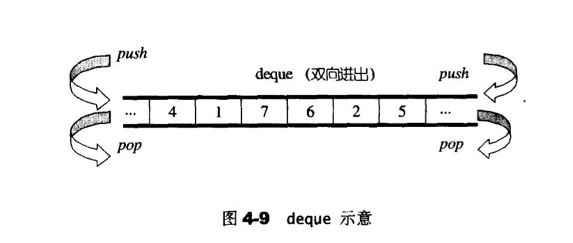
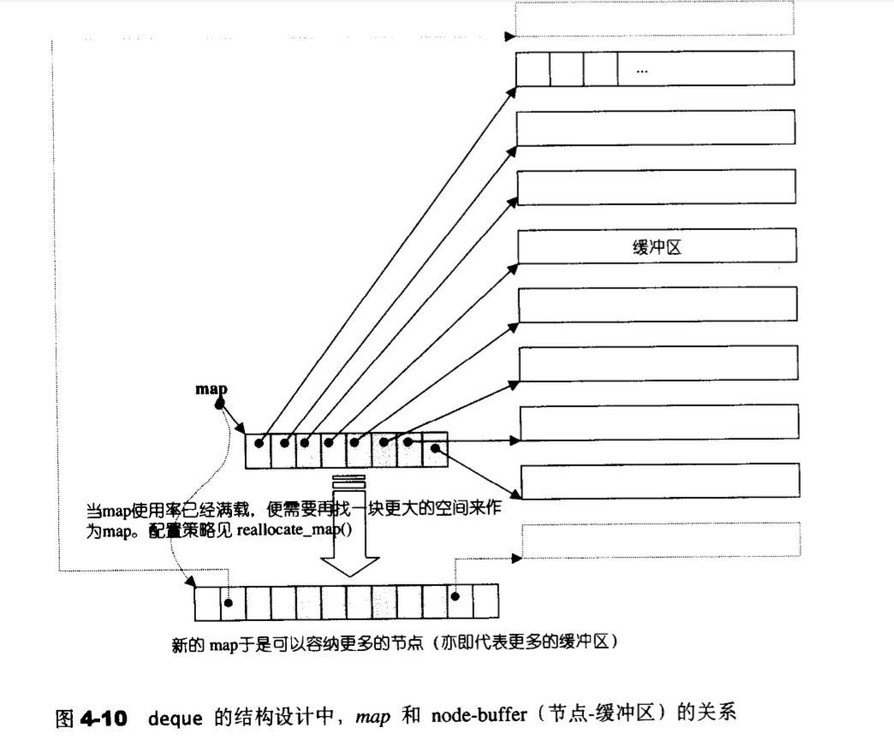
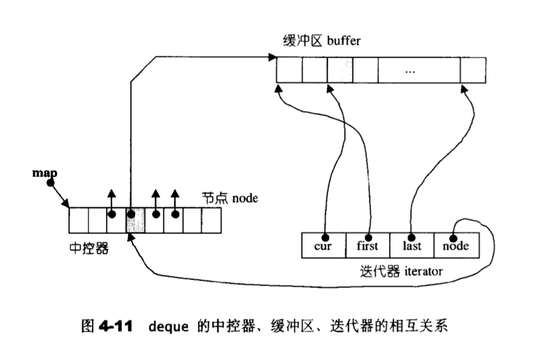

## STL源码解析

### 第一章：STL源码概述与版本介绍
* 前闭后开区间[first, last)，表示从first开始，直到last-1，迭代器最后一个指的是最后一个元素的下一个位置，如下图所示
> 
* STL中的迭代器实际上可以理解为一种泛化的指针类型，重载了operator*(), operator->(),operator++()和operator++(int)
* 仿函数实际上是重载了 
```c++
template<typename T>
class C{
public:
	T operator()(param lists){
		...
	}
};

int main(){
	C<T> cObj;

	//以下使用仿函数，就像使用一般函数一样
	cout << cObj(value lists) << endl;

	//以下使用仿函数，会先产生临时对象（第一对小括号），然后临时对象调用第二对小括号
	cout << cObj()(value lists) << endl;

	return 0;
}
```

### 第二章：空间配置器
* SGI 虽然也定义有一个符合部分标准、名为allocator的配置器，但是SGI却从未使用过，也不建议我么使用，主要是因为其效率不佳，他只是把C++的::operator new 和::operator delete 做了一层薄薄的包装
* STL规定的配置器结构示意图如下
> 

### 第三章：迭代器概念与traits编程技法
* STL的中心思想就是将容器和算法分开，彼此独立设计，最后通过一个迭代器使他们链接在一起（迭代器扮演桥梁的作用）
* 迭代器相应型别有五种
> 1. value type:是指迭代器所指对象的型别
> 2. difference type：是指两个迭代器之间的距离，可以用来表示一个容器的最大容量
> 3. reference type 
> 4. pointer type
> 5. iterator_category：包括input iterator（只读）,output iterator（维写）, forward iterator, bidirectional iterator（双向迭代器）, random access iterator（随机迭代器，支持偏移量大于1）
* [traits编程](https://blog.csdn.net/shudou/article/details/10270971 "traits编程详解")主要是帮助算法识别迭代器的属性（通过内嵌的类型声明），提升算法的运行效率
```c++
template<typename Iterator, typename T>
void func_impl(Iterator iter, T t)
{
    T temp;//这里就解决了问题
    //这里做原本func()的工作
}
 
template<typename Iterator>
void func(Iterator iter)
{
    func_impl(iter, *iter);//func的工作全部都移到func_impl里面了
}
 
int main(int argc, const char *argv[])
{
    int i;
    func(&i);
}
//函数func作为对外接口，实际的操作却由函数func_impl执行，通过函数func_impl的参数类型推导，获取到Iterator指向对象的类型T，但是如果需要返回类型是迭代器所指对象的类型，其无能为力了
```

### 第四章：序列容器
### 1. vector概述
* vector是动态的array，当容量不足时以两倍的方式进行扩容，然后完成元素的搬迁和原空间的释放，位于头文件<vector>中

1.1. vector定义摘要
* SGI STL将vector实现于更底层的<stl_vector.h>

1.2. vector的迭代器
```c++
//vector容器的迭代器模板
tempalte <typename T, class Alloc = alloc>
class vector{
public:
	typedef T value_type;
	typedef value_type* iterator;
...
};
```
1.3. vector的数据结构
* vector采用的数线性连续空间，它以两个迭代器start和finish分别指向配置来的连续空间目前已经使用的范围，并以迭代器end_of_storage指向整个连续空间的尾端（包含备用空间）。具体示意图如下图所示

```c++
template <typename T, class Alloc = alloc>
class vector{
//嵌套类型
public:
	typedef T           value_type;
	typedef value_type* pointer;
	typedef value_type* iterator;
	typedef value_type& reference;
	typedef size_t      size_type;
	typedef ptrdiff_t difference_type;
...
protected:
	iterator start;
	iterator finish;
	iterator end_of_storage;

public:
	iterator begin(){return start;}
	iterator end(){return finish;}
	size_type size() const{return size_type(end() - begin());}
	size_type capacity() const{return size_type(end_of_storage - begin());}
	bool empty(){return begin() == end();}
	reference operator[](size_type n) {return *(beging() + n);}
	reference front() {return *(begin());}
	reference back() {return *(end() - 1);}
...
};
```
> 

1.4. vector 的构造与内存管理
* vector提供了很多默认的构造函数，其中一个允许我们指定空间大小及初值
```c++
//构造函数
vector(size_type n, const T& value){fill_initialize(n, value);}

//填充并初始化
void fill_initialize(size_type n, const T& value){
	start = allocate_and_fill(n, value);
	finish = start + n;
	end_of_storage = finish;
}

//配置而后填充
iterator allocate_and_fill(size_type n, const T& x){
	iterator result = data_allocator::allocate(n); //配置n个元素空间
	uninitialized_fill_n(result, n, x); //会根据第一参数的型别特性决定使用算法fill_n()或反复调用construct()
	return result;
}
```
* push_back()将新元素插入时会先检测是否还要备用空间，有的话直接插入并调整finish++，否则就扩充空间（重新配置两倍大小空间->移动数据->释放原来的空间），这个过程会使院迭代器失效，因此需要赋值给一个新的迭代器

1.5. vector的元素操作：pop_back, erase,clear,insert

#### 2. list概述
* list是一个双向链表，空间不是连续的，对于删除和插入永远是常数个时间
```c++
template <typename T>
struct __list_node{
	typedef void* void_pointer;
	void_pointer prev; // void型，其实可以设为__list_node<T>*
	void_pointer next;
	T data;
}
```
* list的插入和删除只会使被操作的节点的迭代器失效，因为其地址不是连续的，因此只需要对迭代器指针++即可，而vector由于其连续的存储空间会导致元素位置的前移或后移而使得所有迭代器指针失效
> 

2.1. list的构造与内存管理
* list_test.cpp测试了list的部分操作
* 它的构造和析构同vector大致相似
* list提供一个默认的构造函数不指定任何参数而创建一个空list，如下图所示
```c++
public:
	list(){empty_initialize();}

protected:
	void empty_initialize(){
		node = get_node();
		node -> prev = node;
		node -> next = node;
	}
```
> 
* list的push_back()函数内部实际上调用的是insert函数
```c++
void push_back(const T& x){ insert(end(), x);}
```
2.2 list的操作
* 常见的操作有push_front(),push_back(),erase(),pop_front(),pop_back(),clear(),remove(),unique(),splice(),merge(),reverse(),sort()
* 由于list不是连续的因此clear()nebula是不是通过erase删除区间来执行的，而是通过循环遍历一个一个节点删除，析构的
* list内部提供了一个所谓的迁移操作（transfer）：将某连续范围内的元素迁移到指定的位置之前。这也是为实现splice、sort和merge等奠定了基础

#### 3. deque

3.1 deque概述
* 是一个双向开口的连续线性存储空间，即容器两端都可以进行插入和删除操作，示意图如下
> 
* deque和vector的区别在于，前者没有容量的概念，因为它是一个动态分段连续的空间组成的，有段控中心对分配的每一段进行管理（段控中心实际上就是一个map,每一个map对应管理一个连续的缓存空间区)
* deque 本身比较复杂其内部的实现，因此其迭代器的实现也很复杂，主要在分段连续中的迭代器的++或--和跳转操作等如何实现平滑的转移而让用户没有察觉，因此在能用vector解决问题的时候，尽量不要使用deque
* deque内部的排序是通过先把元素复制到vector中排好序后再复制回来
* 

3.2 deque的迭代器
* deque的中控器（控制中心）、缓冲区、迭代器的示意图如下所示
> 

