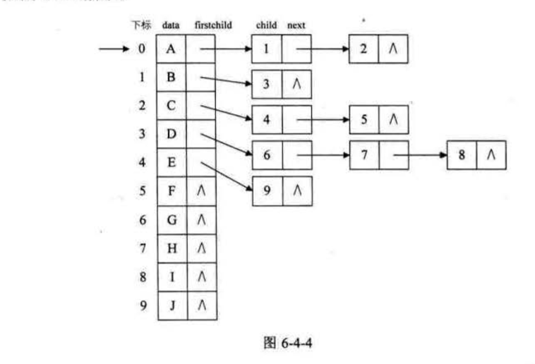

## 大话数据结构

#### 栈的应用
* 递归的内部实现可以看做是一个栈的应用
* 逆波兰式，可以省略括号便于机器进行四则运算，主要的流程如下：
> 对于一个后缀表达式（运算符位于数字的后面）数字依次进栈，当碰到一个符号时弹出栈顶的两个元素，进行运算并将结果进栈，一直到扫描完整个后缀表达式，最后栈低的数字就是计算的结果，弹出即可
* 平时正常的四则运算表达式就是一个中缀表达式：
```math
9+(3-1)*3+10/2  // 中缀表达式
9 3 1-3*+10 2/+ // 对应后缀表达式
```
* 中缀表达式转换为后缀表达式规则
> 从左到右遍历中缀表达式的每个数字和符号，若是数字就输出，即成为后缀表达式的一部分；若是符号，则判断其与楼顶符号的优先级，是右括号或优先级低于栈顶符号(乘除优先加减)则栈顶元素依次出栈并输出，并将当前符号进栈，一直到最终输出后缀表达式为止

* **总结**
1. 将中缀表达式转化为后缀表达式（**栈是用来进出运算符号的**）
2. 将后缀表达式进行运算得出结果（**栈使用来进出运算的数字**）

#### 树的应用
* 树的存储常用的方法有
> 1. 双亲表示法：即在每个节点中设置一个指示器指示其双亲结点到链表中的位置
> 2. 孩子表示法：如下图所示


> 3. 孩子兄弟表示法：设置两个指针，分别指向该节点的第一个孩子和此节点的右兄弟 
* 完全二叉树的性质和判定见演示代码**binary_tree_confirm.cpp**
*  
